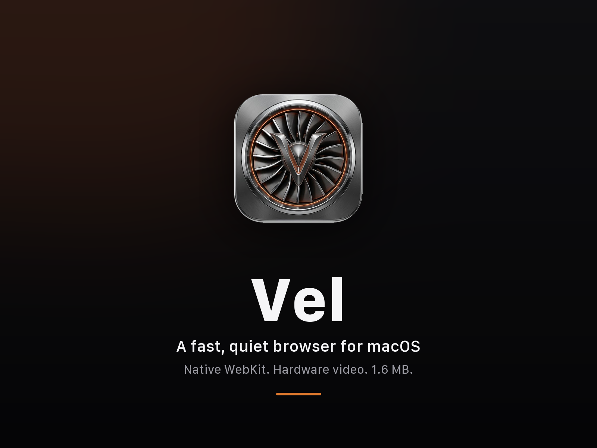
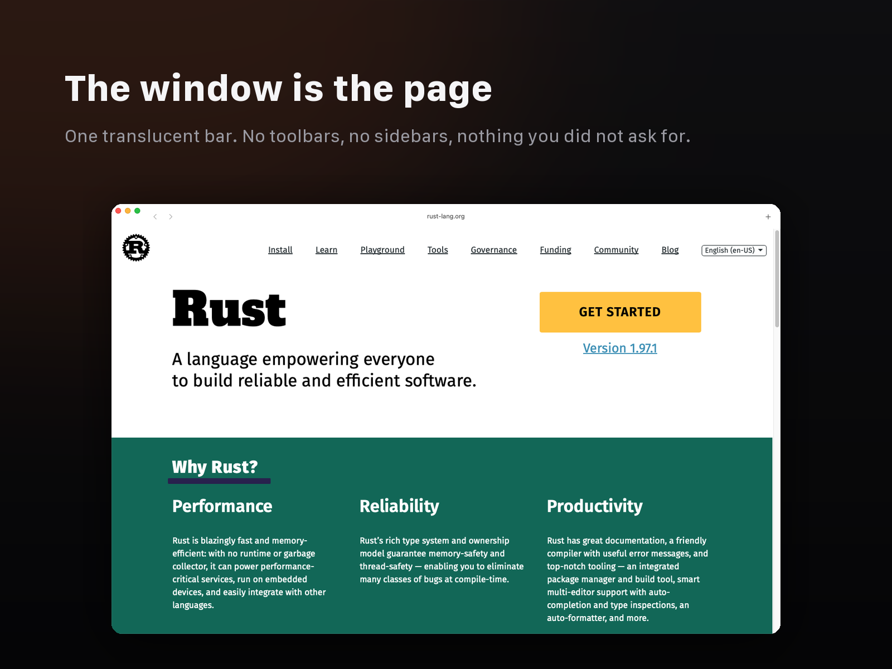
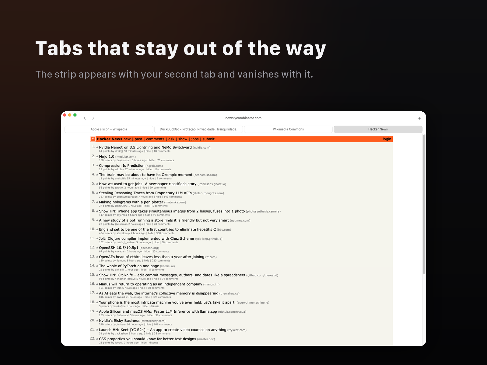
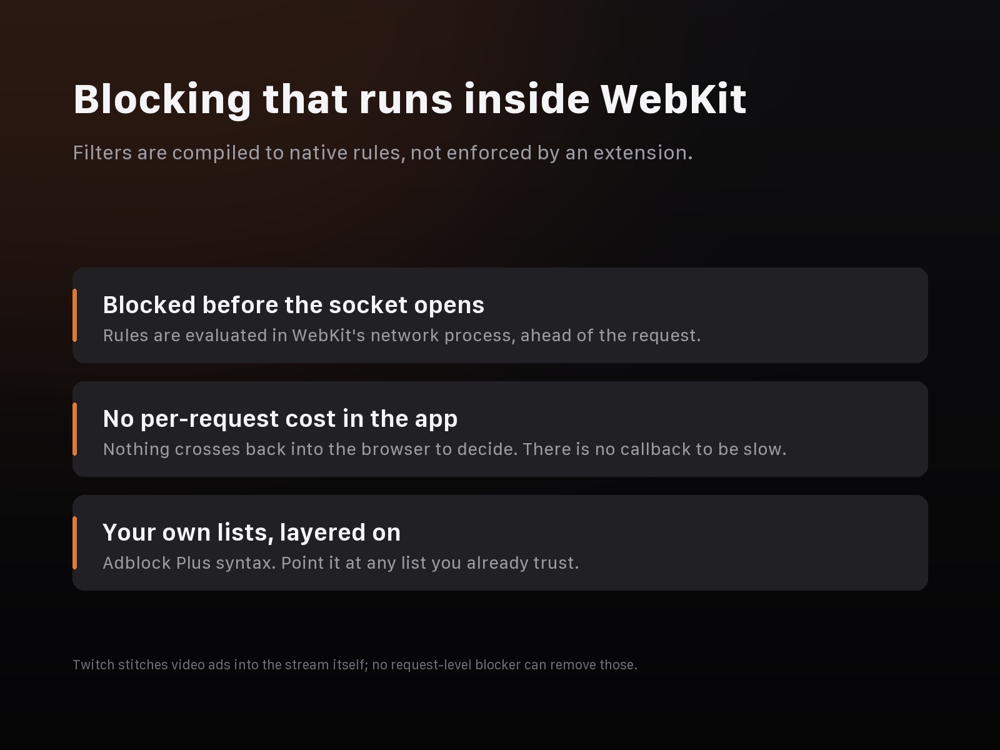
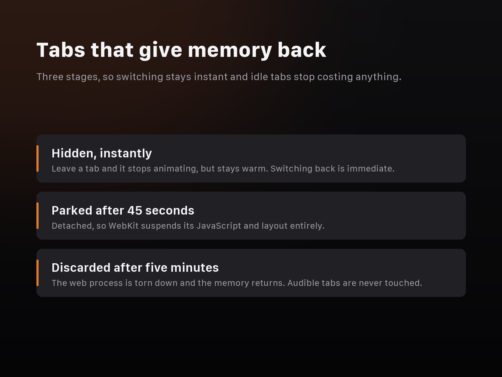
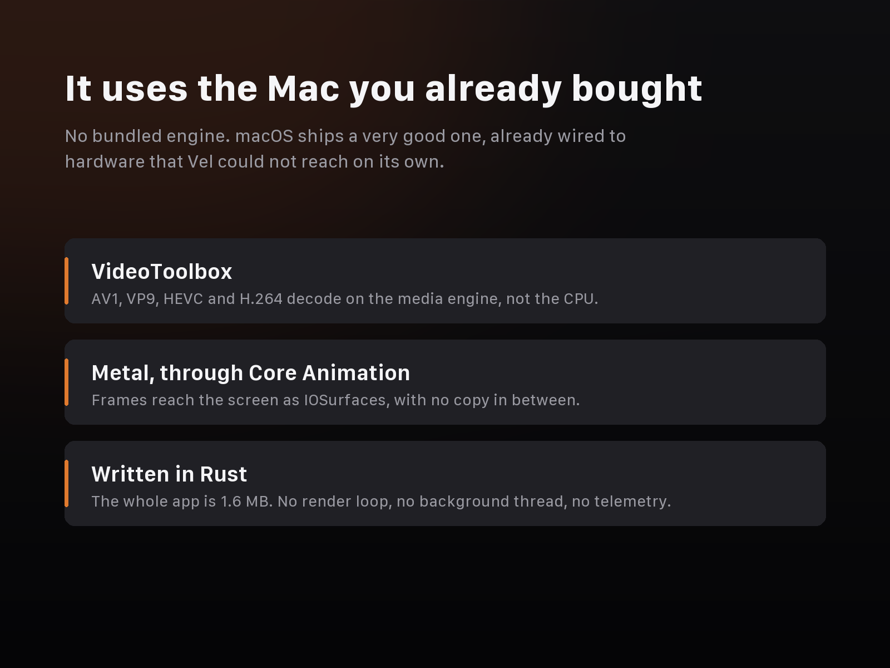
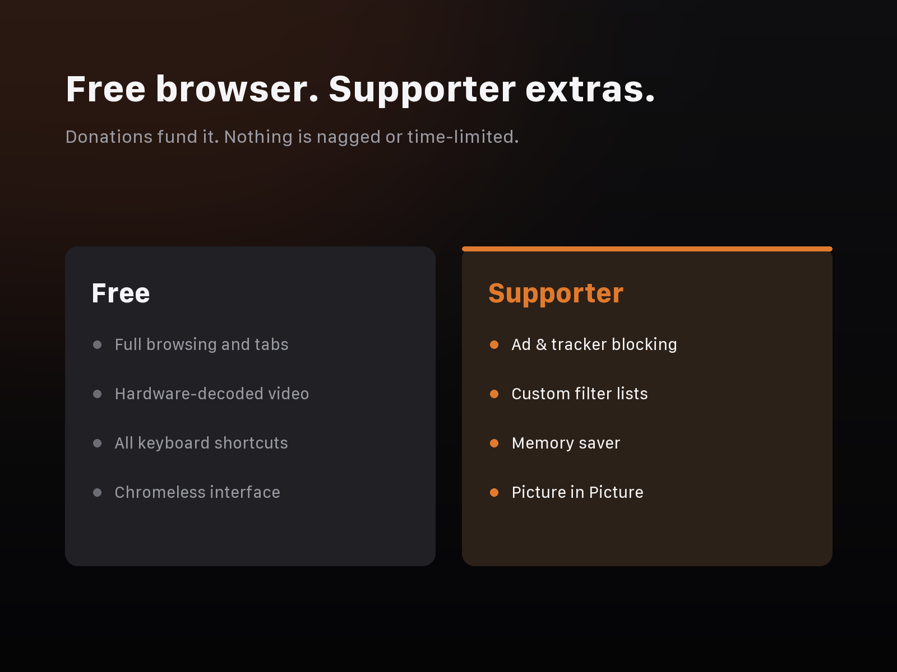
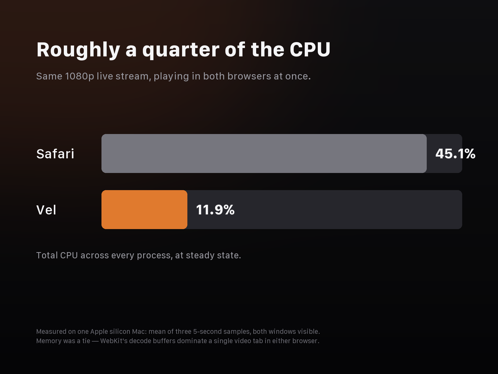

<div align="center">

# ⚡ Vel Browser

**A minimal, ultra-fast macOS browser written in Rust.**

Built around one core principle: the fastest video pipeline on Apple silicon is the one already inside macOS, and the browser's job is to get out of its way.

`WKWebView` · `VideoToolbox` · `Metal` · `AppKit` · `adblock-rust`

[](https://www.rust-lang.org/)
[](https://www.apple.com/macos)
[](https://opensource.org/licenses/MIT)
[](#what-it-is)

<br />



</div>

---

## 🚀 What it is

**Vel** is a macOS browser that renders with system WebKit and adds almost nothing on top: a translucent address bar, a tab strip that only appears when you have more than one tab, and macOS keyboard shortcuts. The whole `.app` bundle is only **1.6 MB**.

There is no bundled rendering engine, no JavaScript in the UI process, no render loop, and no background thread. When nothing is happening, the process is completely asleep.

- **100% Freemium & Open Source**: The core browser is free forever with zero time limits, zero ads, and zero nag screens.
- **Supporter Tier**: Advanced power-user features (*AdBlocker*, *Memory Saver*, *Picture-in-Picture*) can be unlocked via a monthly supporter pass (R$ 9,99/mo) or GitHub Sponsors.

---

## 📸 Product Screenshots & Visual Tour

<div align="center">

### 1. Minimalist Chromeless UI & Hybrid Address Bar


*Translucent address capsule powered by AppKit `NSVisualEffectView`. Auto-adapts to Light & Dark mode.*

<br />

### 2. Dynamic Tab Strip & macOS Keyboard Shortcuts


*Tab strip only appears once you open a second tab. Full support for `Cmd+1`..`9`, `Cmd+T`, `Cmd+W`.*

<br />

### 3. Native Ad & Tracker Blocking (Supporter Pro Feature)


*AdBlock Plus syntax compiled to `WKContentRuleList` evaluated inside WebKit's network process. Blocked requests never open a socket.*

<br />

### 4. Cold Tab Memory Saver (Supporter Pro Feature)


*Cold tabs are detached and discarded, returning RAM directly to macOS when left in background.*

<br />

### 5. Media Pipeline & GPU Acceleration


*VideoToolbox -> Core Animation -> Metal via `IOSurface` zero-copy memory transfer.*

</div>

---

## 💎 Freemium Tiers & Feature Breakdown

Vel follows a transparent, dependency-enforced Freemium model.



| Feature / Capability | 🆓 Free Tier ($0) | 💎 Supporter Pro (R$ 9,99/mo) |
|---|:---:|:---:|
| **AppKit Translucent Toolbar & Hybrid Omnibox** | ✅ Included | ✅ Included |
| **Hardware Video Acceleration (VideoToolbox & Metal)** | ✅ Included | ✅ Included |
| **macOS Native Shortcuts (`Cmd+1..9`, `Cmd+T`, etc.)** | ✅ Included | ✅ Included |
| **Auto-Pause Background Tab Animations** | ✅ Included | ✅ Included |
| **Security Omnibox (Prevents `javascript:` & `data:` exploit execution)** | ✅ Included | ✅ Included |
| **Native Ad & Tracker Blocker (`adblock-rust`)** | 🔒 Supporter | ✅ **Unlocked** |
| **Custom Filter Lists (uBlock Origin / EasyList support)** | 🔒 Supporter | ✅ **Unlocked** |
| **Cold Tab Memory Saver (Instant RAM release)** | 🔒 Supporter | ✅ **Unlocked** |
| **Picture-in-Picture Video Pop-out (`Cmd+Shift+P`)** | 🔒 Supporter | ✅ **Unlocked** |
| **Offline License Key Activation (`supporter.key`)** | 🔒 Supporter | ✅ **Unlocked** |

---

## ⚡ Measured Benchmarks (Side-by-Side vs Safari)

Safari and Vel, side by side, playing the **same 1080p YouTube live stream**, both windows visible, sampled at steady state (average of three 5-second `top` samples on an Apple silicon Mac):



| Component | Safari | Vel Browser | Efficiency Gain |
|---|:---:|:---:|:---:|
| **UI Process** | 53 MB · 6.1% CPU | 48 MB · **0.4% CPU** | **15× Lower UI CPU** |
| **GPU Process** | 92 MB · 17.2% CPU | 44 MB · **5.2% CPU** | **3.3× Lower GPU CPU** |
| **Networking** | 24 MB · 0.8% CPU | 20 MB · 0.6% CPU | Comparable |
| **WebContent (Live)** | 206 MB · 9.0% CPU | 271 MB · 5.7% CPU | Efficient Compositing |
| **TOTAL CPU** | **45.1%** | **11.9%** | **3.8× Lower Total CPU** |
| **TOTAL RAM** | 405 MB | 392 MB | Tie + Discarding |

---

## 🔒 Security & Privacy Guarantees

1. **Zero Telemetry & No Tracking**: Vel contains zero analytics, tracking scripts, or remote logging.
2. **Offline Licence Validation**: Supporter keys (`VEL-XXXXXXXX-CCCC` or Lemon Squeezy UUIDs) are cached locally at `~/Library/Application Support/Vel/supporter.key`. Being offline never costs a supporter their features.
3. **No Secret Tokens in Binary**: Lemon Squeezy endpoints require no secret API token. Client applications make standard `/licenses/validate` calls.
4. **Clean Policy Enforcement**: A single Rust function (`required_tier` in `crates/pro/src/lib.rs`) handles entitlement checks safely.

---

## ⌨️ Keyboard Shortcuts

| Shortcut | Action |
|---|---|
| `Cmd+T` | Open new tab |
| `Cmd+W` | Close current tab |
| `Cmd+1` .. `Cmd+9` | Switch to tab index 1 to 9 |
| `Cmd+Shift+P` | Toggle Picture-in-Picture (Supporter Pro) |
| `Cmd+L` | Focus address bar |
| `Cmd+R` | Reload page |

---

## 🛠️ Building & Running from Source

### Prerequisites
- macOS 12.0+ (Apple Silicon M1/M2/M3/M4 or Intel)
- Rust toolchain (`rustup`)

### Running Locally
```bash
# Clone the repository
git clone https://github.com/httpsDeni/Vel_Browser_Freemium_MAC.git
cd Vel_Browser_Freemium_MAC

# Run in debug mode
cargo run
```

### Running Unit Tests
```bash
cargo test --workspace
```

### Packaging macOS Bundle (.app)
```bash
./build/bundle.sh
```
The output `.app` will be placed in `dist/Vel.app`.

---

## 📄 License

Vel Browser is released under the [MIT License](LICENSE).
